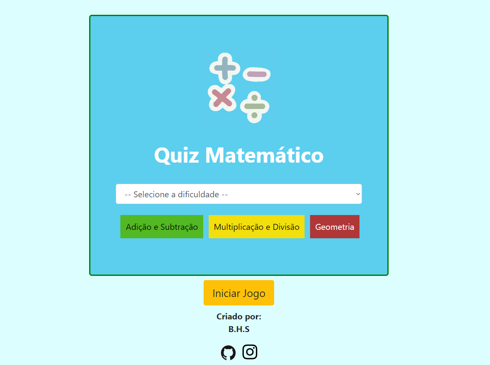

<h1>Quiz-Descritores SAEPE e SAEB</h1>

Olá! Este é um jogo de perguntas e respostas envolvendo questões de interpretação de texto, sendo uma variação do Quiz-Math feito anteriomente

<h2>Tecnologias utilizadas</h2>

 
 
 
 

          

<h3>Visão geral:</h3>
<h4> <a href="https://unexcited-blaze.000webhostapp.com">Acesse aqui o projeto </a> </h4>

